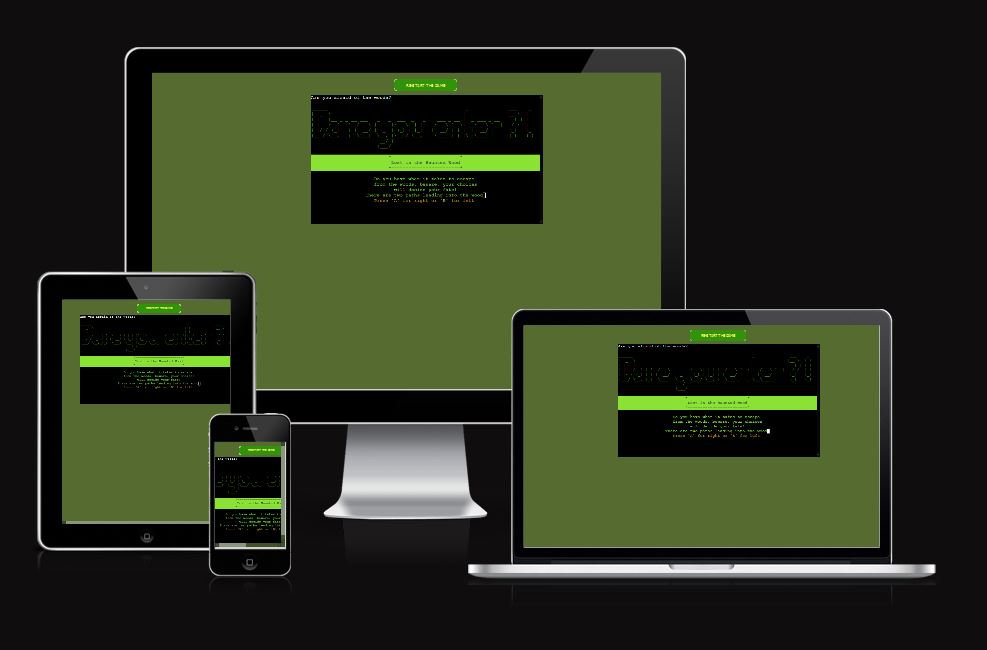

# Lost in the woods

A text based adventure game. The player must navigate the options of the story to arrive at one of two possible endings. The game code is written in Python and uses the code institute template for deployemnt to Heroku cloud hosting platform.

## Live Site

[Live site](https://lost-in-the-woods-1-711f21f2979a.herokuapp.com/)

## Repository

[gitHub repository](https://github.com/Braxxian/Lost-in-the-woods)

## Responsive Design

The game renders well across all screen sizes, although it is best suited for devices with a physical keyboard.
# Contents

(to be populated later)

# How to play

The player is given a short intro and then informed to make a choice of 'A' or 'B' and then press 'Enter' to confirm their choice.

## Planning & Development
### User stories

* As a user I want an entertaining game that can be enjoyed in short leisure breaks
* As a user I want to be able to play the game across all my different devices
* As a user I want to be able to easily learn how to play
* As a user I want a demonstration of how basic python can be used to create a text adventure

### Site Owner goals

* As the site owner I want to provide a fun game that does not require a large amount of the user's time
* As the site owner I want to provide a 'proof of concept' to help other students see how basic python can be used to create a game
* As the site owner I want to be able to extend the sites features in future development

## Features

* The game offers two different user experiences. One branch of the game leads to a happy ending, another branch of the game leads to a bad ending.
* The game uses ASCII Art and color to enhance the terminal's visual impact
* The game opens with an introductory sequence which includes instruction on how to proceed

