# Lost in the woods

A text based adventure game. The player must navigate the options of the story to arrive at one of two possible endings. The game code is written in Python and uses the code institute template for deployemnt to Heroku cloud hosting platform.

## Live Site

[Live site](https://lost-in-the-woods-1-711f21f2979a.herokuapp.com/)

## Repository

[gitHub repository](https://github.com/Braxxian/Lost-in-the-woods)

## Responsive Design

The game renders well across all screen sizes, although it is best suited for devices with a physical keyboard.
# Contents

(to be populated later)

# How to play

The player is given a short intro and then informed to make a choice of 'A' or 'B' and then press 'Enter' to confirm their choice.

## Planning & Development
### User stories

* As a user I want an entertaining game that can be enjoyed in short leisure breaks
* As a user I want to be able to play the game across all my different devices
* As a user I want to be able to easily learn how to play
* As a user I want a demonstration of how basic python can be used to create a text adventure

### Site Owner goals

* As the site owner I want to provide a fun game that does not require a large amount of the user's time
* As the site owner I want to provide a 'proof of concept' to help other students see how basic python can be used to create a game
* As the site owner I want to be able to extend the sites features in future development

## Features

### Game terminal

* The game offers two different user experiences. One branch of the game leads to a happy ending, another branch of the game leads to a bad ending.
* The game uses ASCII Art and color to enhance the terminal's visual impact
* The game opens with an introductory sequence which includes instruction on how to proceed
* The game offers a restart button so player can restart without needing to execute a keyboard interupt

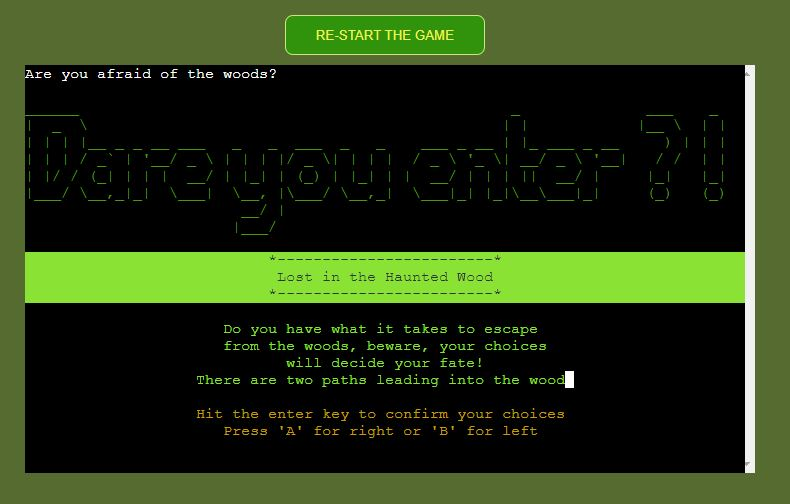

### Algorithm

The game flow was first sketched out in a pseudo-code algorithm

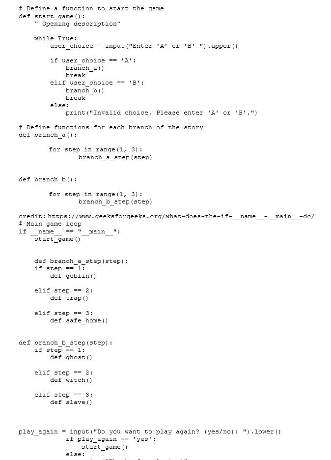

### Flowchart

The game visually realized as a mind map

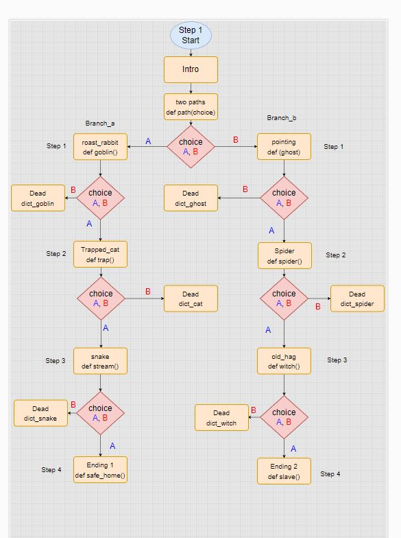

### future development

I would like to add more encounters in the story. Also I would like to invite others to collaborate in turning the 'proof of concept' into a fully realized game.

# Testing

### Manual Testing

The game was tested thoroughly for handling invalid user input and correct game output

| User Action        | Expected Result                 | Actual Result                   | Pass / Fail |
|--------------------|---------------------------------|---------------------------------|-------------|
| Run the program    | Display game title and intro    | Displayed game title and intro  | Pass        |
| Choose 'A' branch  | Follow branch A storyline       | Followed branch A storyline     | Pass        |
| Choose 'B' branch  | Follow branch B storyline       | Followed branch B storyline     | Pass        |
| Make choices (A/B) | Display appropriate game text   | Displayed correct game text     | Pass        |
| Play again (y/n)   | Restart or exit the game        | Restarted or exited the game    | Pass        |
| Invalid input      | Prompt for valid input          | Prompted for valid input        | Pass        |
| Interrupt with Ctrl+C | Handle keyboard interrupt    | Handled keyboard interrupt      | Pass        |

invalid input:

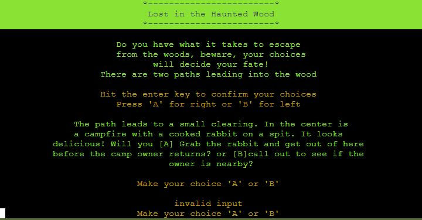

keyboard interrupt

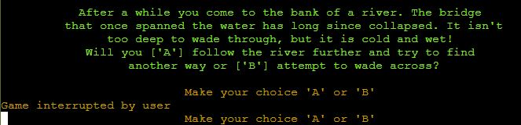

# Validation

The code was passes through the code institute linter and reported no issues

[Code Institute Linter](https://pep8ci.herokuapp.com/)

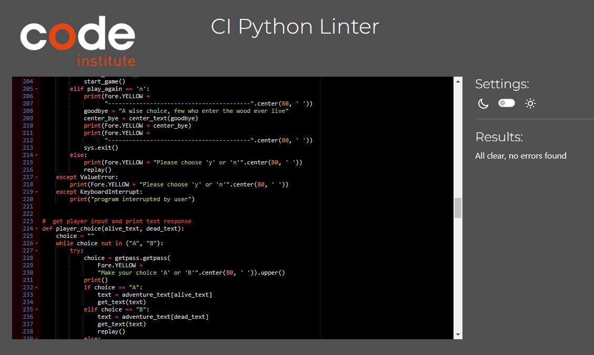

### Lighthouse

Lighthouse mobile performance:

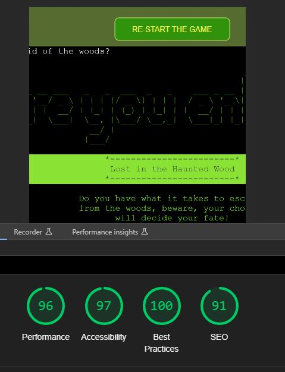

Lighthouse Desktop Performance:

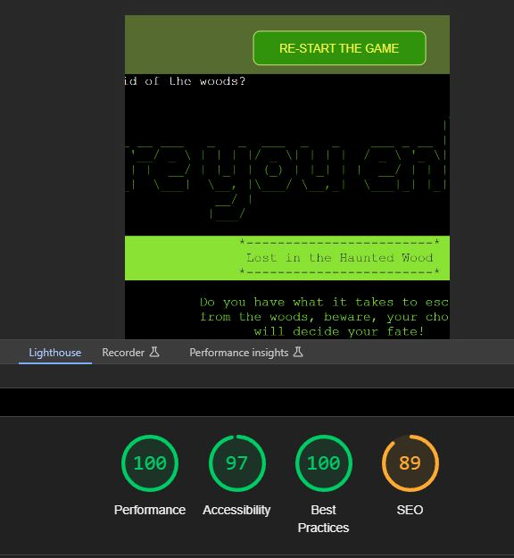

## bugs

There were no major bugs found during development and testing, and all minor issues were resolved in the development process

# Technologies used

 All code was written using: [Visual Studio Code](https://code.visualstudio.com/)

Version Control: [Git](https://git-scm.com/)

Repository: [Github](https://github.com/)

Deployment: [Heroku](Heroku.com/)

# Deployment

## Important:

Before deploying to Heroku, make sure that the requirements.txt in your GitHub repository files contain any libarary dependencies:

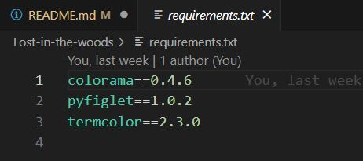

Also ensure any API keys used have been included to .gitignore to keep keys private.

The repository was deployed to Heroku:

First create a new app:
name your app and choose region:

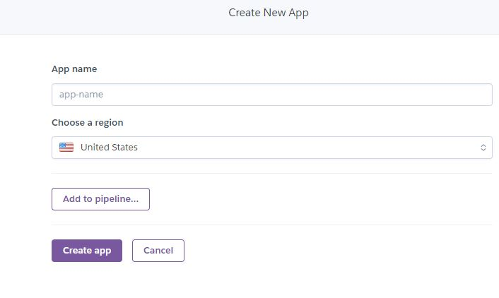

Add port to config and python, node.js build packs

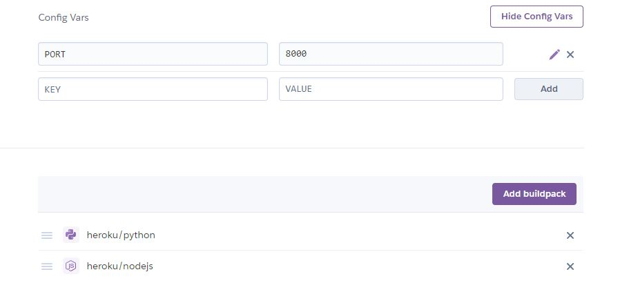

Finally:

    * Connect Heroku to github
    * Authorise the connection
    * Choose repository to connect
    * optionally enable automatic deploys. I chose to deploy each repository update manually so I could observed the process for any errors.

### Note:

As this project was already deployed at the time of writing, further screenshots are unavailable.

## Credits

Thanks to:-

[Bro Code](https://www.youtube.com/watch?v=XKHEtdqhLK8) : This excellent 12 hour tutorial proved invaluable to me, as a beginner both for tutorial and constant reference throughout development.

[Geeks for Geeks](https://www.geeksforgeeks.org/python-programming-language/) : Also used for tutorial and reference.

[pyfiglet](http://www.figlet.org/) : For the ASCII Art.

[The code Institute](https://codeinstitute.net/ie/full-stack-software-development-diploma/) : For the course content.

